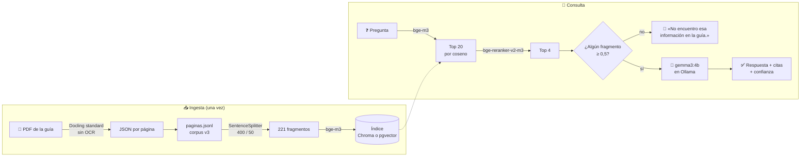

<div align="center">

# 📘 Módulo RAG · Permitido Innovar

**Asistente que responde preguntas usando solo la guía**<br>
**«¿Cómo podemos innovar en los servicios públicos desde la experiencia usuaria?»**

Cita la sección y la página de cada respuesta, dice «No encuentro esa información en la guía.»
cuando la guía no responde y corre entero con modelos locales.

<br>


<br>

[Cómo funciona](#-cómo-funciona) ·
[Resultados](#-resultados) ·
[Inicio rápido](#-inicio-rápido) ·
[LLM en cada equipo](#-llm-en-cada-equipo) ·
[Supabase](#-índice-en-supabase-pgvector) ·
[Evaluación](eval/README.md) ·
[Para agentes de código](AGENTS.md)

</div>

---

## ✨ Qué hace

<table>
<tr>
<td width="50%" valign="top">

### 🎯 Responde solo desde la guía
Si ningún fragmento supera el umbral del reranker, contesta
«No encuentro esa información en la guía.» **sin llamar al LLM**: no hay contexto del que pueda
inventar.

</td>
<td width="50%" valign="top">

### 📍 Cita sección y página
Cada respuesta trae sus fuentes como «Sección › Herramienta, p. N», tomadas de los metadatos del
corpus, no del texto del LLM.

</td>
</tr>
<tr>
<td width="50%" valign="top">

### 🔒 Todo corre en local
Embeddings, reranker y LLM corren en tu equipo. Ni la guía ni las preguntas salen de él (salvo los
vectores, si eliges el índice en Supabase).

</td>
<td width="50%" valign="top">

### 📊 Medido, no supuesto
63 preguntas de evaluación, comparación de modelos, calibración del umbral y de la confianza. Los
resultados se versionan en [`eval/`](eval/README.md).

</td>
</tr>
</table>

---

## 📈 Resultados

Sobre el set de 63 preguntas y el corpus `v3` ([detalle](eval/README.md)), en un Mac M2 de 8 GB:

<div align="center">

| | Métrica | Valor |
| :---: | --- | :---: |
| 🔎 | Sección correcta entre los 4 fragmentos (`recall@4`, con reranker) | **98,0 %** |
| 🥇 | Posición del primer fragmento correcto (`MRR@4`) | **0,961** |
| 🚫 | Preguntas fuera de la guía rechazadas (umbral 0,5) | **100 %** |
| ✅ | Preguntas respondibles rechazadas por error | **0 %** |
| 🟢 | Respondibles con confianza `alta` (reranker ≥ 0,9) | **45 de 51** |

</div>

---

## 🧭 Cómo funciona



| Pieza | Elección | Configuración ([`config.py`](backend/app/rag/config.py)) |
| --- | --- | --- |
| 📄 Extracción | Docling 2.131, pipeline `standard`, sin OCR | — |
| 📚 Corpus | `v3`, una página por registro: créditos (p. 2), prólogos (8–11) y págs. 13–163, con el texto limpio | `VERSION_CORPUS` |
| ✂️ Fragmentos | `SentenceSplitter` de LlamaIndex, 400 tokens, solapamiento 50 | `CHUNK_TOKENS`, `CHUNK_OVERLAP` |
| 🧮 Embeddings | `BAAI/bge-m3` con FlagEmbedding, densos, 1024 dimensiones | `EMBEDDINGS` |
| 🗄️ Vector store | Chroma local o pgvector en Supabase, distancia coseno | `ALMACEN`, `RUTA_CHROMA`, `SUPABASE_DB_URL` |
| 🏅 Reranker | `BAAI/bge-reranker-v2-m3`, puntaje 0–1, 20 candidatos → 4 | `RERANKER`, `RERANKER_CANDIDATOS`, `TOP_K`, `USAR_RERANKER` |
| 🚧 Umbral | Puntaje del reranker ≥ 0,5; si nada llega, se rechaza sin LLM | `UMBRAL` |
| 🦙 LLM | `gemma3:4b` en Ollama, temperature 0,1, contexto de 4096 tokens; o cualquier servidor compatible con OpenAI | `PROVEEDOR_LLM`, `LLM`, `OLLAMA_URL`, `LLM_URL`, `TEMPERATURE`, `CONTEXTO_TOKENS`, `MAX_TOKENS_RESPUESTA` |
| 🎚️ Confianza | Mejor puntaje del reranker: `alta` ≥ 0,9, `media` ≥ 0,7, `baja` el resto | `CONFIANZA_ALTA`, `CONFIANZA_MEDIA` |
| 🖥️ Hardware | `mps`, `cuda:0` o `cpu`; fp16 por defecto | `DISPOSITIVO`, `FP16` |

Todos los parámetros se pueden cambiar por variable de entorno o en `.env`.

### La respuesta

`app.rag.generar --json` devuelve la forma del contrato de `POST /ia/consultar-guia`
([`contrato.py`](backend/app/rag/contrato.py)):

| Campo | Contenido |
| --- | --- |
| `resultado` | Texto de la respuesta, o «No encuentro esa información en la guía.» |
| `encontrada` | `false` si se rechazó por el umbral o por el LLM |
| `confianza` | `alta`, `media` o `baja`, según el reranker; `null` si no se encontró |
| `fuentes` | Lista con `seccion`, `pagina`, `fuente`, `fragmento` y `puntaje` de cada fragmento |
| `modelo`, `version_prompt`, `modo` | Qué generó la respuesta, para auditar; `modo` es `local` o `simulador` |
| `puntaje`, `latencia_s` | Mejor puntaje del reranker y tiempo total |

---

## 🧠 Decisiones de diseño

<details>
<summary><b>Docling <code>standard</code>, sin OCR</b></summary>
<br>

Toma el texto de la capa de texto del PDF y un modelo de layout ordena las columnas y registra la
página de cada bloque, que se usa para citar. El pipeline VLM de Docling, que lee cada página como
imagen, se descartó: sobre esta guía inventa palabras (~6 % no existen en el PDF), tarda ~40 min y no
guarda la página de cada bloque. El texto que está dentro de las láminas y fichas se incluye como
párrafo `[Figura] …`.

</details>

<details>
<summary><b>Una página por registro en el corpus</b></summary>
<br>

Cada página lleva sección, actividad, herramienta y etapa, para citar «sección, p. N» y filtrar por
etapa. Formato en [data/corpus/README.md](data/corpus/README.md).

</details>

<details>
<summary><b>Limpieza del texto extraído</b></summary>
<br>

Docling deja restos del diseño de la guía: palabras cortadas con guion en los diagramas
(«HABILITA- CIÓN»), títulos de herramienta en desorden («MAPA DE COVALOR»), párrafos partidos en
dos y números de paso sueltos. En las págs. 52 y 53, además, la figura es una página de muestra y
Docling leía su texto como si fuera de esas páginas. Desde `v3`, [`ingesta/limpieza.py`](ingesta/limpieza.py)
corrige cada tipo de problema con una regla, y lo que no sigue un patrón con una corrección
contrastada con el PDF. La limpieza va en el código y no a mano, para que se repita igual en cada
regeneración y los embeddings se calculen con el texto limpio.

</details>

<details>
<summary><b>Créditos, prólogos y elaboración en el índice</b></summary>
<br>

El corpus `v1` empezaba en la Introducción, así que el asistente no podía decir quién hizo la guía,
cuándo ni con qué licencia. Desde `v2` también entran los créditos (p. 2), los prólogos (8–11) y
«¿Cómo elaboramos esta guía?» (162–163). Quedan fuera la portada, los índices, las referencias y la
contraportada. Los créditos se indexan como una ficha con los datos de la página: con el texto
extraído, el reranker no relacionaba «¿Quién es el autor de la guía?» con la autoría.

</details>

<details>
<summary><b>bge-m3 + reranker</b></summary>
<br>

bge-m3 es multilingüe, corre local y tiene licencia MIT. Comparado con qwen3-embedding:0.6b y
embeddinggemma sobre el set de evaluación, los tres empatan (recall@4 de 95,7 %). El reranker sube la
recuperación a 97,9 % y ordena mejor los fragmentos (MRR de 0,906 a 0,952), a cambio de ~5 s por
pregunta. Detalle en [eval/README.md](eval/README.md#comparación-de-modelos-de-embeddings).

</details>

<details>
<summary><b>Umbral antes del LLM y confianza desde el reranker</b></summary>
<br>

Si ningún fragmento supera el umbral, la guía no responde la pregunta y se contesta sin llamar al
LLM. El LLM todavía puede rechazar si los fragmentos no responden; el prompt lo obliga a empezar con
esa frase. La confianza y las fuentes salen del reranker y de los fragmentos, no del texto del LLM,
así que no dependen de que un modelo de 4B las escriba bien. Calibración en
[eval/README.md](eval/README.md#umbral-de-rechazo).

</details>

<details>
<summary><b>El corpus se versiona y el PDF no</b></summary>
<br>

El índice se reconstruye desde el corpus con un comando; el PDF se identifica por su SHA-256 en
[`data/fuentes/guia.yaml`](data/fuentes/guia.yaml).

</details>

---

## 🚀 Inicio rápido

> [!IMPORTANT]
> Necesitas **Python 3.12** y [Ollama](https://ollama.com/download). Si Ollama no te funciona, usa
> LM Studio u otro servidor (ver [LLM en cada equipo](#-llm-en-cada-equipo)). La primera ejecución
> descarga bge-m3 y el reranker desde Hugging Face (~2,3 GB cada uno); después corren sin red.

**1. Crea el entorno e instala las dependencias**

```bash
python3.12 -m venv .venv
```

```bash
.venv/bin/pip install -r ingesta/requirements.txt -r requirements-dev.txt -c requirements.lock
```

`requirements.lock` fija las versiones exactas con que se midió [`eval/`](eval/): sin él, pip instala
las más nuevas dentro de los rangos, y una versión nueva de transformers o torch puede cambiar los
puntajes. En Linux o WSL agrega `--extra-index-url https://download.pytorch.org/whl/cpu`: el lock fija
torch de CPU, que está en el índice de PyTorch. La consulta sola (sin Docling) necesita únicamente
`backend/requirements.txt`.

**2. Descarga el LLM (~3,3 GB).** Con LM Studio, sigue [LLM en cada equipo](#-llm-en-cada-equipo).

```bash
ollama pull gemma3:4b
```

**3. Construye el índice.** El corpus `v3` ya está en el repositorio, así que basta con indexar:

```bash
.venv/bin/python -m ingesta.indexar
```

Si la API está corriendo, reiníciala después de indexar: abre el índice una sola vez.

**4. Pregunta** (desde `backend/`):

```bash
cd backend && ../.venv/bin/python -m app.rag.generar "¿Qué es un mapa de momentos críticos?" --etapa 7
```

| Opción | Qué hace |
| --- | --- |
| `--json` | Muestra la respuesta con la forma del contrato |
| `--etapa N` | Le da al LLM el contexto de la etapa del proyecto (1 a 7) desde la que se pregunta: actividad, objetivo y herramientas ([`guia.py`](backend/app/rag/guia.py)). Se ve con `python -m app.rag.prompts --etapa N` |
| `--filtrar-etapa` | Busca solo en la actividad de esa etapa |

Para ver solo la recuperación, sin LLM:

```bash
cd backend && ../.venv/bin/python -m app.rag.recuperar "¿Qué es un mapa de momentos críticos?" --etapa 7
```

Aquí `--etapa` filtra por etapa y `--sin-reranker` muestra el orden solo por similitud, para comparar.

**5. Próximos pasos de una etapa** (asistente por etapa, desde `backend/`):

```bash
cd backend && ../.venv/bin/python -m app.rag.sugerir 7 --contexto "Renovación del permiso de circulación"
```

No hay pregunta: busca los fragmentos de la actividad de esa etapa (filtrados por etapa) y el LLM
sugiere qué busca la etapa, de tres a cinco próximos pasos y la herramienta de la guía, con citas.
`--datos '{"mapa_momentos_criticos": "pendiente"}'` agrega el avance registrado en la etapa,
`--json` muestra la forma del contrato y `--ver-prompt` muestra el prompt sin llamar al LLM. La API
lo expone como `POST /ia/sugerir-proximos-pasos` (ver [Chatbot de prueba](#-chatbot-de-prueba)).

> [!NOTE]
> En un Mac de 8 GB, con bge-m3, el reranker y gemma3:4b cargados a la vez, falta memoria y cada
> respuesta tarda entre 50 s y 4 min. Una pregunta rechazada por el umbral no llama al LLM.

<details>
<summary><b>🔁 Regenerar el corpus desde el PDF</b></summary>
<br>

Por ejemplo, si cambia la guía o la versión de Docling:

```bash
.venv/bin/python -m ingesta.extraer "/ruta/a/Guia_ComoInnovar.pdf"
```

```bash
.venv/bin/python -m ingesta.corpus
```

`ingesta.extraer` compara el hash del PDF con `data/fuentes/guia.yaml`. `ingesta.corpus --ver 148`
muestra cómo quedó una página (con `--crudo`, antes de la limpieza). Un cambio que altere el corpus
va en una versión nueva (`data/corpus/v4/`), no sobre `v3`.

</details>

---

## 🦙 LLM en cada equipo

Cada equipo elige en su `.env` qué LLM redacta las respuestas, sin tocar el código. El archivo es el
mismo en Mac, Windows y Linux: copia `.env.example` como `.env` y cambia solo lo que necesites. La
búsqueda no cambia (bge-m3, reranker, umbral); solo cambia quién redacta.

| Caso | `PROVEEDOR_LLM` | Qué más va en `.env` |
| --- | --- | --- |
| Ollama en tu equipo (por defecto) | `ollama` | Nada |
| Ollama en otro equipo | `ollama` | `OLLAMA_URL=http://<IP>:11434` |
| LM Studio u otro servidor compatible con la API de OpenAI | `openai` | `LLM_URL` y `LLM` |

### Si Ollama no te funciona: LM Studio

[LM Studio](https://lmstudio.ai) es una aplicación con interfaz gráfica para Mac, Windows y Linux.

1. Descarga un modelo desde LM Studio. Para comparar con el actual, uno de la familia Gemma 3; con
   16 GB de memoria cabe el de 12B.
2. Al cargarlo, deja el largo de contexto en 4096 tokens o más, y pon ese mismo valor en
   `CONTEXTO_TOKENS`.
3. Inicia el servidor local en la pestaña **Developer**. Queda en `http://localhost:1234/v1`.
4. En `.env`:

   ```
   PROVEEDOR_LLM=openai
   LLM_URL=http://localhost:1234/v1
   LLM=<nombre del modelo>
   ```

   El nombre exacto aparece en LM Studio y en `http://localhost:1234/v1/models`.

Sirve igual cualquier otro servidor compatible con la API de OpenAI; solo cambia `LLM_URL`. Por
ejemplo, `llama-server` de llama.cpp queda en `http://localhost:8080/v1`.

> [!WARNING]
> Un servicio en la nube compatible con OpenAI también funciona con `PROVEEDOR_LLM=openai`, pero
> entonces las preguntas y los fragmentos de la guía salen del equipo. Eso rompe el procesamiento
> local acordado con UXLab: úsalo solo si el equipo y UXLab lo aprueban, nunca con datos reales, y
> guarda la clave con `python -m app.rag.secretos guardar LLM_API_KEY` (desde `backend/`), igual que
> `SUPABASE_DB_URL`.

### Usar el LLM de otro equipo

Si tu equipo tiene poca memoria, otro equipo de la misma red puede correr el LLM. El tuyo solo
carga bge-m3 y el reranker.

**En el equipo que corre el modelo**, deja el servidor escuchando en la red:

- **Ollama**: define `OLLAMA_HOST=0.0.0.0:11434` y reinicia Ollama.
  - macOS: `launchctl setenv OLLAMA_HOST "0.0.0.0:11434"` y vuelve a abrir la app.
  - Windows: cierra Ollama desde la barra de tareas, agrega `OLLAMA_HOST` en «Editar las variables
    de entorno de tu cuenta» y vuelve a abrirlo.
  - Linux: `sudo systemctl edit ollama.service`, agrega `Environment="OLLAMA_HOST=0.0.0.0:11434"`
    bajo `[Service]` y reinicia con `sudo systemctl restart ollama`.
- **LM Studio**: en la configuración del servidor, activa la opción para servir en la red local.

Busca su IP (macOS: `ipconfig getifaddr en0`; Windows: `ipconfig`, línea «Dirección IPv4»; Linux:
`hostname -I`). Si Windows pregunta por el firewall, permite el acceso en redes privadas.

**En tu equipo**, apunta a esa IP en `.env`: `OLLAMA_URL=http://<IP>:11434` con Ollama, o
`LLM_URL=http://<IP>:1234/v1` con LM Studio.

> [!CAUTION]
> Ni Ollama ni LM Studio piden contraseña. Úsalos solo en la misma red Wi-Fi o con una VPN entre
> equipos (por ejemplo, Tailscale), nunca expuestos a internet.

### En Windows

Los comandos de este README usan rutas de Mac y Linux. En Windows, crea el entorno con
`py -3.12 -m venv .venv` y cambia `.venv/bin/` por `.venv\Scripts\`, por ejemplo
`cd backend; ..\.venv\Scripts\python -m app.rag.generar "…"`. Con una GPU NVIDIA, pon
`DISPOSITIVO=cuda:0` en `.env`; si no, bge-m3 y el reranker corren en `cpu`.

### Al comparar modelos

- `GET /salud` muestra el proveedor, la URL y el modelo activos; la última línea de
  `app.rag.generar`, el modelo.
- El prompt se ajustó con `gemma3:4b`. Otro modelo puede citar o rechazar distinto: corre las mismas
  preguntas y anota el modelo, el equipo y el tiempo de respuesta.
- La primera respuesta de un modelo grande tarda más. Si se corta, sube `TIMEOUT_S` (180 s por
  defecto).
- Sin Ollama corre todo menos `eval/comparar_embeddings.py`, que usa Ollama para los embeddings que
  compara.

---

## 🐘 Índice en Supabase (pgvector)

Con `ALMACEN=pgvector` el índice vive en Supabase, en la tabla `public.data_guia_fragmentos`
(`vector(1024)`, índice HNSW por coseno y RLS sin políticas, así que la API pública no la lee). Los
embeddings se siguen calculando en local; a Supabase solo llegan los vectores, el texto y los
metadatos.

<details>
<summary><b>Configurar paso a paso</b></summary>
<br>

1. Copia el connection string del *Session pooler* (Project Settings › Database › Connection
   string), con la contraseña de la base, y guárdalo. El valor se pide sin mostrarlo, así que no
   queda en el historial de la terminal:

   ```bash
   cd backend && ../.venv/bin/python -m app.rag.secretos guardar SUPABASE_DB_URL
   ```

   Dónde queda depende del equipo (`python -m app.rag.secretos donde` te lo dice):

   | Equipo | Dónde queda |
   | --- | --- |
   | macOS, Windows, Linux con escritorio | Cifrado en el llavero del sistema (Llavero de macOS, Administrador de credenciales, GNOME Keyring o KWallet) |
   | WSL, Linux sin escritorio, contenedor | En `.env`, que git ignora, legible solo para tu usuario |

   Con `--en-env` va a `.env` aunque haya llavero (por ejemplo, si el de Linux pide la contraseña en
   cada consulta). Si ya lo tenías en `.env` y tu equipo tiene llavero, muévelo con `desde-env`.
   El valor no puede contener `${`, porque `.env` lo reemplazaría al leerlo.
2. Aplica la migración con la [CLI de Supabase](https://supabase.com/docs/guides/cli):

   ```bash
   npx supabase link --project-ref <project-ref>
   ```

   ```bash
   npx supabase db push
   ```

   o directamente con `psql`:

   ```bash
   psql "$(cd backend && ../.venv/bin/python -m app.rag.secretos exportar SUPABASE_DB_URL)" \
     -f supabase/migrations/20261001120000_indice_guia.sql
   ```

3. Carga el índice. Si ya está en Chroma, copia esos mismos vectores sin cargar el modelo:

   ```bash
   ALMACEN=pgvector .venv/bin/python -m ingesta.indexar --desde-chroma
   ```

   o vectoriza el corpus desde cero:

   ```bash
   ALMACEN=pgvector .venv/bin/python -m ingesta.indexar
   ```

4. Compara la recuperación con Chroma (deja el resultado en `eval/resultados/`):

   ```bash
   .venv/bin/python eval/comparar_almacenes.py
   ```

La tabla guarda una sola configuración. Si cambia el corpus o la fragmentación, se vuelve a ejecutar
el paso 3; la consulta avisa si la tabla se cargó con otra configuración. Si cambia el modelo de
embeddings (y con él la dimensión), hace falta una migración nueva.

</details>

Chroma y pgvector devuelven los mismos 20 candidatos, en el mismo orden, en las 52 preguntas;
pgvector suma ~0,8 s por pregunta por la ida y vuelta a Supabase.

> [!WARNING]
> `SUPABASE_DB_URL` da acceso completo a la base: va en el llavero del sistema o, en equipos sin
> llavero, en `.env` (ver [`secretos.py`](backend/app/rag/secretos.py)); nunca en el frontend ni en
> una variable `VITE_`, ni pegada en un chat o un commit. Supabase
> pausa los proyectos gratuitos tras una semana sin actividad: antes de una demo, revisa que el
> proyecto esté activo.

---

## 🧪 Evaluación

| Script | Qué hace | Requisitos |
| --- | --- | --- |
| [`calibrar_umbral.py`](eval/calibrar_umbral.py) | Prueba umbrales de rechazo y cortes de confianza (sin LLM, ~9 min) | — |
| [`probar_asistente_etapa.py`](eval/probar_asistente_etapa.py) | Prueba el prompt del asistente por etapa con 9 escenarios ficticios (~15 min) | El LLM corriendo (Ollama con `gemma3:4b` u otro) |
| [`comparar_embeddings.py`](eval/comparar_embeddings.py) | Compara bge-m3, qwen3-embedding y embeddinggemma, con y sin reranker | Ollama con `qwen3-embedding:0.6b` y `embeddinggemma` |
| [`comparar_almacenes.py`](eval/comparar_almacenes.py) | Compara la recuperación en Chroma y en pgvector | Los dos índices y `SUPABASE_DB_URL` |

```bash
.venv/bin/python eval/calibrar_umbral.py
```

Métricas, tablas y últimos resultados en [eval/README.md](eval/README.md).

---

## 💻 Chatbot de prueba

La interfaz de chat (React 19 + Vite + TypeScript) le pregunta a la API de
[`backend/app/api.py`](backend/app/api.py), que llama a `generar.responder()` y devuelve la respuesta
con sus fuentes y su confianza. Se necesitan dos terminales, más el servidor del LLM corriendo
(Ollama con `gemma3:4b`, o el que elijas en [LLM en cada equipo](#-llm-en-cada-equipo)).
Para consultar el índice de Supabase, pon `ALMACEN=pgvector` en `.env` y guarda `SUPABASE_DB_URL` (paso 1).

```bash
cd backend && ../.venv/bin/uvicorn app.api:app --port 8000
```

```bash
npm install && npm run dev
```

Vite reenvía `/ia` y `/salud` a `http://localhost:8000` (cámbialo con `RAG_API_URL`), así que el
backend no necesita CORS. Las preguntas se atienden de a una y la primera carga los modelos, así que tarda más;
en un Mac de 8 GB cada respuesta puede tardar minutos. Si el LLM no está disponible, la API responde
503 con el motivo y la interfaz lo muestra en el chat. `GET /salud` muestra la configuración activa
y `http://localhost:8000/docs`, el esquema de la API.

La API también atiende el asistente por etapa, con los mismos campos que la plataforma ya envía.
`etapa` (1 a 7) es obligatoria; `contexto` (texto o diccionario) y `datos_etapa` (diccionario), no.
Responde con la misma forma que `POST /ia/consultar-guia`, con `version_prompt` `etapa-v1`:

```bash
curl -X POST localhost:8000/ia/sugerir-proximos-pasos -H 'Content-Type: application/json' \
  -d '{"etapa": 7, "contexto": "Renovación del permiso de circulación", "datos_etapa": {"mapa_momentos_criticos": "pendiente"}}'
```

### Adjuntos (PDF y DOCX)

La persona puede adjuntar un documento con el clip del chat. Por ahora el chatbot **solo lo lee**:
todavía no responde preguntas sobre él. `POST /ia/adjuntos` ([`backend/app/adjuntos/`](backend/app/adjuntos/))
lo procesa en cuatro pasos:

1. **Valida** el formato, que el contenido corresponda a la extensión y el tamaño, antes de pedir
   turno: un archivo inválido no hace cola.
2. **Extrae** el texto con Docling, con las mismas opciones que la ingesta de la guía (sin OCR). En
   un PDF, pypdfium2 cuenta las páginas y rechaza los PDF con contraseña y los escaneados antes de
   cargar el layout. Cada página se contrasta con su texto crudo: con el PDF de ejemplo, Docling pegó
   el párrafo de la página 3 a la página 2.
3. **Seudonimiza** RUT (con dígito verificador), correos y teléfonos: `[RUT_1]`, `[CORREO_1]`,
   `[TELEFONO_1]`, con el mismo marcador para el mismo valor en todo el documento. **Los nombres de
   personas todavía no se detectan.**
4. **Indexa en memoria**, separado de la guía, con la misma fragmentación, bge-m3 y reranker. No se
   guarda en disco ni en Supabase, y se descarta a los `MINUTOS_ADJUNTO` (60) o al quitarlo
   (`DELETE /ia/adjuntos/{id}`). Si la API se reinicia, hay que volver a subirlo.

```bash
curl -F archivo=@backend/tests/datos/adjuntos/perfil.pdf localhost:8000/ia/adjuntos
curl -X DELETE localhost:8000/ia/adjuntos/<adjunto_id>
```

| Variable | Por defecto | Qué controla |
| --- | --- | --- |
| `FORMATOS_ADJUNTO` | `pdf,docx` | Formatos aceptados; el código también lee `md` (`pdf,docx,md`) |
| `MAX_MB_ADJUNTO` | `10` | Tamaño máximo (413 si lo pasa) |
| `MAX_PAGINAS_ADJUNTO` | `40` | Páginas máximas de un PDF (413) |
| `MIN_CARACTERES_PAGINA` | `30` | Bajo este promedio por página, el PDF se trata como escaneado (422) |
| `MINUTOS_ADJUNTO` / `MAX_ADJUNTOS` | `60` / `5` | Cuánto dura un adjunto en memoria y cuántos se guardan a la vez |

Errores con qué hacer en `detail`: 415 formato o contenido que no corresponde, 413 tamaño o páginas,
422 vacío, dañado, con contraseña o sin texto, 503 sin turno o sin modelos. El log registra
formato, KB, páginas, fragmentos y cantidad de datos reemplazados; nunca el nombre del archivo ni su
texto. `GET /salud` informa `formatos_adjunto`, `max_mb_adjunto` y `adjuntos_vigentes`.

**Medido el 2026-10-07** en un Mac M2 de 8 GB, con los ejemplos de
[`backend/tests/datos/adjuntos/`](backend/tests/datos/adjuntos/) (datos ficticios):

| Archivo | Respuesta | Tiempo |
| --- | --- | --- |
| `perfil.pdf` (3 páginas), primero tras arrancar | 200, 2 fragmentos | 13,2 s (carga el layout de Docling y bge-m3) |
| `perfil.pdf`, segunda vez | 200 | 1,4 s |
| `perfil.docx` | 200, 4 fragmentos | 0,6 s |
| `escaneado.pdf` | 422 | < 0,01 s |
| `no-es-pdf.pdf` | 415 | < 0,01 s |

Con el layout de Docling y bge-m3 cargados, el proceso de la API ocupa **3,6 GB** (`footprint`; el
RSS de `ps` sale mucho menor porque macOS comprime la memoria). Una pregunta suma el reranker
(~1,2 GB) y el LLM corre aparte (gemma3:4b, ~3,3 GB): en un equipo de 8 GB, subir un PDF y preguntar
en la misma sesión queda justo. Un DOCX no carga el layout.

### Revisión de entregables

`POST /ia/revisar-entregable` ([`backend/app/revision/`](backend/app/revision/)) revisa un documento
ya subido con `POST /ia/adjuntos` contra lo que pide la guía para su herramienta. Por ahora hay
rúbrica para el **Perfil de persona usuaria** (pp. 148–149). **No juzga si el contenido es bueno o
malo**: revisa que esté lo que pide la guía y resume lo cargado en dos o tres frases.

```bash
curl -H 'Content-Type: application/json' -d '{"adjunto_id": "<adjunto_id>", "herramienta": "perfil_persona_usuaria"}' \
  localhost:8000/ia/revisar-entregable
cd backend && ../.venv/bin/python -m app.revision.revisar tests/datos/adjuntos/perfil.docx   # sin la API
cd backend && ../.venv/bin/python -m app.revision.revisar tests/datos/adjuntos/perfil.docx --ver-prompt   # sin LLM
```

1. **Rúbrica.** Lo que pide la guía, punto por punto, en
   [`data/rubricas/perfil_persona_usuaria.yaml`](data/rubricas/perfil_persona_usuaria.yaml): cada
   criterio con su página y paso, si es **obligatorio** (las preguntas de la lámina) o
   **recomendado** (lo que la guía sugiere), y cuándo está incompleto. `validada: false` hasta que
   UXLab la apruebe.
2. **Resumen.** Una llamada al LLM: quién es la persona, su rol, qué necesita, qué espera y cómo se
   relaciona hoy con el servicio.
3. **Un criterio a la vez.** Lo que se puede contar lo revisa el código (la cantidad de perfiles,
   por sus títulos). El resto, el LLM, con el documento y el punto, y responde un JSON con la
   evidencia (copiada del documento), el estado y lo que falta. El servidor del LLM recibe el JSON
   Schema (`format` en Ollama, `response_format` en un servidor compatible con OpenAI). El documento
   va igual en todas las llamadas, así que Ollama lo procesa una vez.
4. **Nunca «cumple» sin evidencia.** Si el LLM marca «cumple» o «parcial» con una evidencia que no
   está en el documento, el punto queda `no_evaluable` (❔) y se le pide a la persona que lo revise.
5. **Datos personales.** El LLM recibe el texto seudonimizado; la respuesta vuelve con los valores
   reales, porque va a quien subió el archivo.

La respuesta trae `resumen`, cada criterio con `estado` (`cumple`, `parcial`, `no_cumple`,
`no_evaluable`), `evidencia`, `sugerencia` y `cita` («p. 148, paso 3»), y `resultado`: el checklist en
markdown para mostrar en el chat (✅ ⚠️ ❌ ❔; los recomendados que faltan van como sugerencias). La
página sale de la rúbrica, no del LLM. Un documento de más de `MAX_CARACTERES_ENTREGABLE` (6000)
caracteres se revisa con los fragmentos del adjunto más relevantes para cada punto. Errores: 422
herramienta sin rúbrica, 404 adjunto vencido, 503 sin turno o sin LLM. `GET /salud` lista las
herramientas en `herramientas_revision`.

**Medido el 2026-10-09** en un Mac M2 de 8 GB con gemma3:4b y los ejemplos de
`backend/tests/datos/adjuntos/`: `perfil.docx` en 49 s (11 llamadas al LLM) y `perfil.pdf` por la
API en 54 s (12 llamadas: en el PDF no hay títulos, así que la cantidad de perfiles la decide el
LLM), más 9,7 s de la subida. Con gemma3:4b la revisión corre, pero se equivoca: marcó la
«Validación» como cumplida con la frase de las entrevistas, y las «Variables de caracterización» como
incompletas con un texto que no tiene que ver. La comprobación de la evidencia solo revisa que la cita
esté en el documento, no que responda al punto. La calidad se mide con un modelo más grande y un set
de entregables con su revisión esperada.

### Simulador para integrar la plataforma

Con `MODO=simulador`, la API responde con respuestas fijas de
[`simulador.py`](backend/app/rag/simulador.py): mismas rutas, validación, errores y campos, pero sin
cargar modelos. Así la plataforma puede integrar los dos endpoints en cualquier servidor,
sin esperar al equipo que tiene los modelos. Solo necesita tres dependencias:

```bash
python3.12 -m venv .venv-sim && .venv-sim/bin/pip install -r backend/requirements-simulador.txt
cd backend && MODO=simulador ../.venv-sim/bin/uvicorn app.api:app --port 8000
```

Las marcas `#no-encontrada`, `#confianza-media`, `#confianza-baja` y `#error` en la pregunta
fuerzan cada caso; `etapa` 1, 2 o 7 elige la respuesta, y `SIMULADOR_DEMORA_S` agrega una espera.
`POST /ia/adjuntos` valida el archivo de verdad y devuelve un adjunto fijo; `#sin-texto` (422) y
`#error` (503) en el nombre del archivo fuerzan esos casos. `POST /ia/revisar-entregable` devuelve
una revisión fija del perfil, armada con la rúbrica, para un `adjunto_id` que entregó el simulador
(404 con cualquier otro).
En `POST /ia/sugerir-proximos-pasos` hay una respuesta por cada etapa, armada con los datos de
`guia.py`, y las marcas van en `contexto` o en `datos_etapa`. En
Render: directorio raíz `backend`, build `pip install -r requirements-simulador.txt`, start
`uvicorn app.api:app --host 0.0.0.0 --port $PORT` y las variables `MODO=simulador` y `CLAVE_SERVICIO`.

**Clave de servicio.** Si `CLAVE_SERVICIO` tiene valor, los `POST` y el `DELETE` exigen
`Authorization: Bearer <clave>` y responde 401 sin ella (`/salud` no la pide). La API la llama el
backend de la plataforma, que ya valida la sesión de la persona: la clave nunca va en el navegador.
En tu equipo se guarda con `python -m app.rag.secretos guardar CLAVE_SERVICIO` (desde `backend/`;
llavero o `.env`, como `SUPABASE_DB_URL`); en un servidor, como variable de entorno. Vacía, la API
no pide clave: así funciona el chatbot de prueba. Si la API arranca sin clave, lo avisa en el log.

**Turno, cola y errores.** Los modelos atienden una consulta a la vez. Mientras se atiende una,
esperan turno hasta `COLA_MAXIMA` más (2 por defecto), cada una `ESPERA_TURNO_S` como máximo (300 s):

| Situación | Respuesta |
| --- | --- |
| La cola está llena | `503` de inmediato, con `Retry-After: 120` |
| No llegó el turno a tiempo | `503` con `Retry-After: 120` |
| El servidor del LLM o el índice de Supabase no responden | `503` con qué revisar en `detail` |
| Cualquier otro error | `500` con un `detail` genérico; la traza queda en el log |

`GET /salud` no espera turno: responde aunque la cola esté llena. `listo` dice si los modelos ya
están cargados y `clave`, si la API la pide. Con `PRECARGAR=true` la API carga bge-m3, el reranker y
el índice al arrancar, en segundo plano, y la primera consulta no los espera; conviene en un
servidor que atiende a la plataforma. El LLM lo carga su propio servidor con la primera consulta.

**Log.** Cada solicitud deja una línea `clave=valor` en el log de uvicorn, y cada respuesta otra con
el desglose de tiempos y los tokens del LLM ([`registro.py`](backend/app/rag/registro.py)). No
guardan el texto de la pregunta ni del proyecto, solo su largo. Por ejemplo, la primera pregunta tras
arrancar (la recuperación incluye cargar los modelos) en un Mac M2 de 8 GB, una pregunta que el
umbral rechaza y una consulta con la cola llena:

```text
INFO app.rag.generar: etapa=- filtrar_etapa=false largo_pregunta=30 mejor=0.95 fragmentos=4 t_recuperacion_s=25.9 t_llm_s=53.3 tokens_prompt=1683 tokens_respuesta=78 encontrada=true
INFO app.api: ruta=consultar-guia estado=200 espera_s=0 latencia_s=79.2 encontrada=true confianza=alta mejor=0.95 fuentes=4 modo=local prompt=v4
INFO app.rag.generar: etapa=- filtrar_etapa=false largo_pregunta=32 mejor=0.032 fragmentos=0 t_recuperacion_s=101.6 llm=no tokens_prompt=0 tokens_respuesta=0 encontrada=false
WARNING app.api: ruta=consultar-guia estado=503 motivo=cola_llena
```

`mejor` es el puntaje del reranker, también en las preguntas rechazadas: con `grep llm=no` salen las
que no pasaron el `UMBRAL`, el dato para recalibrarlo con preguntas reales.

**Tokens.** `tokens_prompt` (instrucciones, fragmentos y pregunta) y `tokens_respuesta` son los que
informa el servidor del LLM; «-» si no los informa. Con un modelo local no tienen costo por uso,
pero sirven para estimar cuánto costaría la misma consulta en un servicio que cobra por token: tokens
de cada tipo × su precio. Es una estimación: cada modelo cuenta los tokens con su propio
tokenizador, así que otro modelo puede contar unos más o unos menos. Una pregunta que el umbral rechaza registra 0, porque no llama al LLM. Para sumarlos,
guarda el log al arrancar la API (`uvicorn app.api:app --port 8000 2>&1 | tee api.log`) y después:

```bash
awk '/tokens_prompt=/ {n++; for (i=1; i<=NF; i++) if ($i ~ /^tokens_(prompt|respuesta)=[0-9]+$/) {split($i, c, "="); t[c[1]] += c[2]}}
     END {print n " consultas · prompt: " t["tokens_prompt"]+0 " · respuesta: " t["tokens_respuesta"]+0}' api.log
```

---

## ✅ Tests y CI

Los tests de [`backend/tests/`](backend/tests/) prueban lo que decide el backend sin cargar modelos
ni llamar a Ollama: el umbral, la confianza, las fuentes, la detección del rechazo del LLM, los
campos del contrato, la validación de la API y las etapas con el contexto que recibe el LLM
(contrastadas con el corpus `v3`), las reglas de limpieza del corpus y las de la revisión de
entregables (rúbricas, evidencia, estados), con un LLM de prueba. Corren en segundos.

```bash
.venv/bin/pip install -r requirements-dev.txt
.venv/bin/python -m pytest
.venv/bin/ruff check
```

No miden la calidad de las respuestas: eso lo hacen los scripts de [`eval/`](eval/). El
[CI](.github/workflows/ci.yml) corre `ruff check` y `pytest` para el backend, y `npm run lint` y
`npm run build` para el chatbot, en cada PR y en cada push a `main`, con las versiones de
`requirements.lock`. Dependabot propone una vez al mes las actualizaciones de npm, pip y GitHub
Actions.

Para actualizar las dependencias de Python, cambia los rangos de los `requirements*.txt` (o acepta
el PR de Dependabot), regenera el lock con [uv](https://docs.astral.sh/uv/) y vuelve a correr la
evaluación que corresponda:

```bash
uv pip compile requirements-dev.txt ingesta/requirements.txt --universal --python-version 3.12 --torch-backend cpu -o requirements.lock --upgrade
```

Sin `--upgrade`, `uv` conserva las versiones del lock y solo agrega o quita lo que cambió.

---

## 🗂️ Estructura

```text
.
├── backend/
│   ├── app/api.py          API HTTP (FastAPI): POST /ia/consultar-guia, /ia/sugerir-proximos-pasos,
│   │                       /ia/adjuntos y /ia/revisar-entregable, DELETE /ia/adjuntos/{id}
│   ├── app/adjuntos/       Adjuntos: extraer (Docling), seudonimizar, indice (en memoria), cargar
│   ├── app/revision/       Revisión de entregables: rubricas, chequeos (sin LLM), prompts, revisar
│   ├── app/rag/            Consulta: config, modelos, indice, recuperar, guia, prompts, generar;
│   │                       asistente por etapa: prompts_etapa, sugerir; flujo (pasos comunes de
│   │                       los dos), contrato (forma de la respuesta), simulador (respuestas
│   │                       fijas, sin modelos) y registro (log por consulta)
│   ├── requirements-simulador.txt  Solo la API con MODO=simulador
│   └── tests/              Tests con pytest, sin modelos ni Ollama; datos/adjuntos/, ejemplos ficticios
├── ingesta/                PDF → JSON de Docling → corpus (con limpieza) → índice vectorial
├── data/
│   ├── corpus/v3/          Corpus vigente, una página por línea (paginas.jsonl); v2, el anterior
│   ├── fuentes/guia.yaml   Manifiesto y SHA-256 del PDF (el PDF no se versiona)
│   └── rubricas/           Lo que pide la guía para cada herramienta, para revisar entregables
├── eval/                   Preguntas, scripts de comparación y calibración, resultados
├── supabase/migrations/    Tabla public.data_guia_fragmentos con pgvector
├── src/                    Chatbot de prueba (React + Vite), conectado a la API
├── requirements.lock       Versiones exactas de Python con que se midió eval/
└── .github/                CI (lint, tipos, build y tests) y Dependabot
```

---

## 📜 Licencia y créditos

La guía **«¿Cómo podemos innovar en los servicios públicos desde la experiencia usuaria?»**, de la
serie *Permitido Innovar: Guías para transformar el Estado chileno*, es del Laboratorio de Gobierno
(Ministerio de Hacienda, Gobierno de Chile) y del Observatorio UX de la Universidad Tecnológica
Metropolitana (2025). Se publica con licencia
[CC BY-NC-SA 4.0](https://creativecommons.org/licenses/by-nc-sa/4.0/deed.es), que también aplica al
corpus derivado en `data/corpus/`.

<div align="center">
<br>
<sub>Hecho en Chile 🇨🇱 · Modelos locales · Tus preguntas no salen del equipo</sub>
</div>
